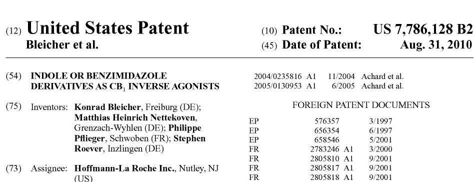

```{r setup, include=FALSE}
knitr::opts_chunk$set(echo = TRUE)
library("shiny")
library("shinydashboardPlus")
library("ggplot2")
library("viridis")
library("RColorBrewer")
library("knitr")
library("png")
library("cowplot")
library("plotly")
library("shinyWidgets")
library("dplyr")
library("data.table")
```

<!-- <head> -->
<!-- <!-- Global site tag (gtag.js) - Google Analytics --> -->
<!-- <script async src="https://www.googletagmanager.com/gtag/js?id=UA-71167447-1"></script> -->
<!-- <script> -->
<!--   window.dataLayer = window.dataLayer || []; -->
<!--   function gtag(){dataLayer.push(arguments);} -->
<!--   gtag('js', new Date()); -->
<!--   gtag('config', 'UA-71167447-1'); -->
<!-- </script> -->
<!-- </head> -->

<br>

<a href="http://cieb.unibas.ch/" target = "_blank">{ width=25% }</a>
```{r, echo = F}
socialButton(url = "http://github.com/cieb-unibas",  type = "github")
socialButton(url = "https://twitter.com/cieb_unibas",  type = "twitter")
a(actionButton(inputId = "email1", label = "Mail us",
                 icon = icon("envelope", lib = "font-awesome")),
    href="mailto:cieb@unibas.ch")
```

<br>

## <font color='#68838B'>**Cross-border commuting and inventions 'Made in Switzerland'** </font>

*September 2020* by <a href="https://wwz.unibas.ch/de/personen/matthias-niggli/" target = "_blank">Matthias Niggli</a> and <a href="https://wwz.unibas.ch/de/personen/christian-rutzer/" target = "_blank">Christian Rutzer</a>
```{r, echo = F}
renderText("Share this article") 
    socialButton(url = "http://twitter.com/", type = "twitter")
    socialButton(url = "http://facebook.com/", type = "facebook")
    socialButton(url = "http://linkedin.com/", type = "linkedin")
    socialButton(url = "http://xing.com/", type = "xing")
```

**Every day over 300 000 people from neighboring countries cross the border to work in Switzerland. Many of them contribute substantially to the development of new innovations by Swiss companies. At the same time, many standard innovation indicators do not properly take this Swiss-specific phenomenon into account and the Swiss economy could be even more innovative than generally thought. In fact, innovative activity could be underestimated by around 10% for the country as a whole - and by up to 30% for some specific regions and industries.**

<br>

Cross-border commuters are important for the Swiss economy. This is especially the case for some Swiss regions and the industries that these regions have specialized in. For example, the most recent figures of the <a href = https://www.bfs.admin.ch/bfs/en/home/statistics/work-income/employment-working-hours/employed-persons/swiss-foreign-nationals/cross-border-commuters.html target = “_blank”> Swiss Federal Statistic Office</a> highlight that the Lake Geneva region and the region of Northwestern Switzerland alone attract almost 200 000 cross-border commuters. As for specific industries, we can, for example, look at the Swiss pharmaceutical sector –the country’s largest exporter. This industry employs so many cross-border commuters that without taking them into account its labor productivity would be clearly overestimated (see  <a href = Link Output Dragan target = “_blank”>Title Output Dragan </a>).

If cross-border commuters play such an important role for overall economic activity in Switzerland, what about their role for the development of new inventions in Switzerland? Are these workers also substantially contributing to innovations by Swiss companies? Are there differences across industries in how strongly they rely on cross-border commuting workers? In what follows, this article takes a closer look at all of these issues.

<br>

#### <font color='#68838B'>**How to determine the origin of an invention?**</font>

Every other year, reports such as the <a href = https://www.globalinnovationindex.org/Home target = “_blank”>Global Innovation Index</a>, the <a href = https://www.weforum.org/reports/how-to-end-a-decade-of-lost-productivity-growth target = “_blank”>Global Competitiveness Report</a> or the <a href = https://www.wipo.int/publications/en/series/index.jsp?id=38 target= “_blank”>World Intellectual Property Report</a> evaluate the innovative capacity of countries. One of the measures these studies typically use are patents or patent applications. More precisely, they look at the number of patents that were filed by inventors of a given country. This is possible because patent documentations state the residence addresses of all the inventors for any given patent. You can see this in an example of a patent document below.

<br>

<br>

As you can see, this patent states four different “Inventors”. Three are from Germany and one from France. If more than one country is mentioned on the patent, there are two possibilities to assign a patent to countries. The first option is to simply raise the patent count of all the mentioned countries equally by one. The second option is to proportionally divide the patent among all the mentioned countries according to the share of inventors from that country on the patent. With the first option, our example-patent would be equally assigned to Germany and France. With the latter one, Germany would get assigned ¾ of the patent and France ¼, which takes into account that there were more German than French inventors involved when the invention was developed.

There is also a third option. Instead of focusing on inventors, one can consider the location of the company that owns the patent. In our example-patent, this is stated as the location of the “Assignee” right under the “Inventors” information. In this case the patent is owned by a US subsidiary of pharma giant Hoffmann-La Roche and would therefore be attributed to the U.S. Patenting of foreign subsidiaries are quite common and, therefore, company addresses are rather sparely used to determine patent origin. All the pros and cons of these different approaches are, for example, briefly and comprehensively discussed in a recent report by <a href = https://www.bertelsmann-stiftung.de/fileadmin/files/user_upload/BST_Weltklassepatente_2020_DT.pdf target = “_blank”>Bertelsmann</a> (p. 68).

The optimal choice among these approaches depends on the question one wants to answer. In this article, we investigate innovative capacities in Switzerland. So, for our purpose it is best to follow the common approach to look at inventor addresses and to use shares in order to assign patents to countries.

But what if inventors live in neighboring countries and commute to a workplace in Switzerland where they contribute to new inventions? Then the patent would not be assigned to Switzerland 

<br>
<center>{ width=50% }</center>
<br>


