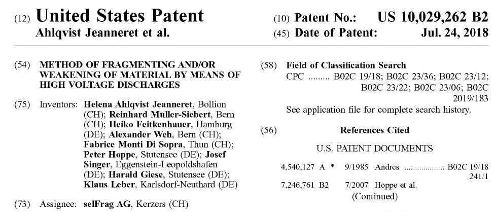

```{r setup, include=FALSE}
knitr::opts_chunk$set(echo = TRUE)
library("shiny")
library("shinydashboardPlus")
library("ggplot2")
library("viridis")
library("RColorBrewer")
library("knitr")
library("png")
library("cowplot")
library("plotly")
library("shinyWidgets")
library("tidyverse")
library("data.table")
library("DT")
```

<!-- <head> -->
<!-- <!-- Global site tag (gtag.js) - Google Analytics --> -->
<!-- <script async src="https://www.googletagmanager.com/gtag/js?id=UA-71167447-1"></script> -->
<!-- <script> -->
<!--   window.dataLayer = window.dataLayer || []; -->
<!--   function gtag(){dataLayer.push(arguments);} -->
<!--   gtag('js', new Date()); -->
<!--   gtag('config', 'UA-71167447-1'); -->
<!-- </script> -->
<!-- </head> -->

<a href="http://cieb.unibas.ch/" target = "_blank">{ width=25% }</a>
```{r, echo = F}
socialButton(url = "http://github.com/cieb-unibas",  type = "github")
socialButton(url = "https://twitter.com/cieb_unibas",  type = "twitter")
a(actionButton(inputId = "email1", label = "Mail us",
                 icon = icon("envelope", lib = "font-awesome")),
    href="mailto:cieb@unibas.ch")
```

<br>

# <font color='#68838B'>**Cross-border commuting and inventions 'Made in Switzerland'** </font>

*September 2020* by <a href="https://wwz.unibas.ch/de/personen/matthias-niggli/" target = "_blank">Matthias Niggli</a>, <a href="https://wwz.unibas.ch/de/personen/christian-rutzer/" target = "_blank">Christian Rutzer</a> and <a href="https://wwz.unibas.ch/de/personen/dragan-filimonovic/" target = "_blank">Dragan Filimonovic</a>


Picture: <a href="https://www.flickr.com/photos/stormsworld/8456586910/in/photolist-JfMjzY-Jf3uBk-9HwYDV-ZiCo9F-2jagrVH-HMX3CB-szWiqL-PsKy3L-bRHW5-HbJ87t-mWUYYB-J6PXd-228e7G7-nX4vQD-GAoNUV-AnHZzL-QonY9T-TUXSe1-MynNKE-yoSd93-dwmhsa-WyYCTY-7oFhzy-easv3-4VR2iw-BG4XB8-UkSxzU-ZbG9qo-uYNiyQ-aq6HJV-2gTznUx-3dSjtL-P2g2FQ-8xkuwR-6nJEim-5bA2Ve-5bA2yK-7Xo2QH-8qknKq-5aLf3M-t8HmX-8upbZT-3avCQY-dThdEA-2gaaCH-C2ckEz-5aQ6UU-26Frxpu-bV9qz-57bbjv" target = "_blank">Barry Davis | Flickr</a>

```{r, echo = F}
renderText("Share this article") 
    socialButton(url = "http://twitter.com/", type = "twitter")
    socialButton(url = "http://facebook.com/", type = "facebook")
    socialButton(url = "http://linkedin.com/", type = "linkedin")
    socialButton(url = "http://xing.com/", type = "xing")
```

<br>

**Over 300 000 people from neighboring countries are crossing the border to work in Switzerland. Many of them contribute substantially to the development of new innovations by Swiss companies. As many standard innovation indicators do not properly take this Swiss-specific phenomenon into account, the Swiss economy could be even more innovative than generally thought. In fact, innovative activity could be underestimated by around 10% for the country as a whole - and by up to 30% for some specific regions and industries.**

Cross-border commuters are important for the Swiss economy. This is especially the case for some Swiss regions and the industries that these regions have specialized in. For example, the most recent figures of the <a href = https://www.bfs.admin.ch/bfs/en/home/statistics/work-income/employment-working-hours/employed-persons/swiss-foreign-nationals/cross-border-commuters.html target = “_blank”> Swiss Federal Statistic Office</a> highlight that the Lake Geneva region and the region of Northwestern Switzerland together attract already almost 200 000 cross-border commuters. As for industries, we can, for example, look at the Swiss pharmaceutical sector – notably the country’s largest exporter. The pharmaceutical industry employs so many cross-border commuters that without taking them into account its labor productivity would, for example, be substantially overestimated (see  <a href = Link Output Dragan target = “_blank”>Title Output Dragan </a>). 

If cross-border commuters play such an important role for overall economic activity in Switzerland, what about their role for the development of new inventions? Are these workers also substantially contributing to innovations by Swiss companies? And are there differences across industries in how strongly they rely on cross-border commuting workers? In what follows, this article takes a closer look at such questions.

<br>

## <font color='#68838B'>**How to determine the origin of an invention?**</font>

Every other year, reports such as the <a href = https://www.globalinnovationindex.org/Home target = “_blank”>Global Innovation Index</a>, the <a href = https://www.weforum.org/reports/how-to-end-a-decade-of-lost-productivity-growth target = “_blank”>Global Competitiveness Report</a> or the <a href = https://www.wipo.int/publications/en/series/index.jsp?id=38 target= “_blank”>World Intellectual Property Report</a> evaluate the innovative capacity of countries. One of the measures these studies typically use are patents. More precisely, they look at the number of patents that were filed by inventors of a given country. This number can be determined because patent documentations always state the residence countries of all the inventors for any given patent. You can see this in an example below.

<br>
<center>
<a href="https://patentimages.storage.googleapis.com/2d/2c/18/51725e50ce657b/US10029262.pdf" target = "_blank">
{ width=70% }</a> 
</center>
<br>

This patent states nine different “Inventors”. Five are from Germany and four are from Switzerland. The German locations (e.g. Hamburg) and the Swiss ones (e.g. Bern) are rather far away from each other. This suggests that two different labs collaborated for this patent and the inventors did not all work in the same place. Some of the research was probably conducted in Germany and some was in Switzerland.  There are two possibilities to link patents to countries if more than one country is mentioned on a patent. The first option is to simply raise the patent count of all the mentioned countries equally by one. The second option is to proportionally divide the patent among the countries according to the share of inventors from each country. With the first option, our example-patent would be equally assigned to Germany and Switzerland. With the latter one, $\frac{5}{9}$ of the patent would be assigned to Germany and $\frac{4}{9}$ to Switzerland. This approach takes into account that there were more German than Swiss residents involved in the development of the patent.

There is also a third option. Instead of focusing on inventors, one can consider the location of the company that owns the patent. In our example, this is the location of the patent’s “Assignee”. In this case, the patent is owned by selFrag AG from Kerzers, Switzerland, and it would therefore be attributed to Switzerland only. Because of this - and also because patents are sometimes filed by foreign subsidiaries or headquarters - company addresses are rarely used to determine patent origins. For more information, a recent report by <a href = https://www.bertelsmann-stiftung.de/fileadmin/files/user_upload/BST_Weltklassepatente_2020_DT.pdf target = “_blank”>Bertelsmann (p. 68)</a> briefly and comprehensively discusses the pros and cons of these different options. The optimal choice mostly depends on the question one wants to answer. In this article, we want to investigate innovative capacities in Switzerland. For this purpose, it is best to follow the most common approach, which is to look at inventor addresses and to use shares to assign patents to countries.

<div class=bloc_div>
<blockquote>***Such a patent would not be assigned to Switzerland even though all the research and development was conducted in a company’s Swiss-based facility.***</blockquote> 
</div>

Now, for the case of Switzerland, recall the very high numbers of cross-border commuters in, for example, Geneva or Basel. What if *all* the inventors of a patent developed in Switzerland live in neighboring countries and commute to a workplace in Switzerland? Such a patent would not be assigned to Switzerland even though all the research and development was conducted in a company’s Swiss-based facility. In addition, focusing on the location of the firm would also not solve the problem if the patent was filed by a foreign affiliate of the Swiss-based firm. The picture below shows an example of a patent with exactly these characteristics.

<br>
<center>
<a href="https://patentimages.storage.googleapis.com/d3/fc/90/f9374c9864e9b2/US7786128.pdf" target = "_blank"> { width=70% }</a>
</center>
<br>

All the inventors of this patent live in Germany or France and the assignee of the patent is a U.S.-affiliate of Swiss pharmaceutical giant Hoffmann-La Roche. With the above-mentioned approaches, such a patent would never be attributed to Switzerland. However, the places of residence of all inventors are very close to the region of Basel (e.g. Grenzach-Wylen, Freiburg). Furthermore, Hoffmann-La Roche’s headquarter is located in Basel and some of its major research facilities are in this region. Therefore, it is very likely that this patent was in fact developed in Basel by cross-border commuters from Germany and France and later filed at the <a href = “https://www.uspto.gov/” target = “_blank”>United States Patent and Trademark Office (USPTO)</a> by a U.S. branch of Hoffmann-La Roche. The actual invention, however, was conducted in Switzerland and the patent should thus also be attributed to Switzerland.

<br>

## <font color='#68838B'>**Cross-border commuters and innovation in Switzerland** </font>

In what follows, we investigate inventions by cross-border commuters in Switzerland. For this analysis, we use patent data from the <a href = “https://www.uspto.gov/” target = “_blank”>USPTO</a> for U.S. patents and from the <a href = “xxx” target = “_blank”>OECD</a> for European patents. In this <a href = “xxx” target = “_blank”>report (Link Output Christian)</a> you can read more about the datasets we use for all of our analyses and how they were processed. In the textbox below, you find a description of how we identify cross-border commuting inventors in Switzerland. 

<br>

<div class="box_div">
<p style="font-size:18px">**Searching for cross-border commuting inventors in Switzerland**</p>
<details>
  <summary>*Click here to read about our empirical approach*</summary>

  The patent data we use for the first step of the analysis is from the <a href = “https://www.uspto.gov/” target = “_blank”>USPTO</a>. It covers the period 1990 to 2015 and is cleaned for patent equivalents (for more information on patent equivalents see e.g. <a href = “xxx” target = “_blank”>xxx</a> ). As described above, this data always features information on the resident countries of inventors and companies. Furthermore, USPTO data also contains the coordinates of their resident addresses. Combining these pieces of information, allows us to develop an approach to empirically identify cross-border commuting inventors in Switzerland.
  
  Let’s start with the general idea. A patent is a candidate for being co-invented by a cross-border commuter if this inventor’s resident country is not Switzerland, but the company that owns the patent is in Switzerland. Of course, this general idea would be way too broad for a final definition. Recall, for example, our first example patent: The company was based in Switzerland and several inventors were living in Germany. As outlined above, this does not mean that they are necessarily cross-border commuters. For example, one of the German inventors lived in Hamburg and it is almost impossible that somebody is commuting over such a huge distance to Switzerland.
  
  Therefore, we need to refine the general approach. In order to do this, we introduce a limit on the distance between company and inventor locations. If the distance is too large, we consider commuting impossible. To calculate distances, we use the coordinates of inventor and company residence addresses. We then assign the cross-border commuter status if
  
1. inventors are not living in Switzerland **and** 
2. the company that owns the patent is based in Switzerland **and** 
3. inventors are not living too far away from where the Swiss company is located. 
  
  Consequently, an inventor who is mentioned on a patent filed by a Swiss-based company but is living in Hamburg would not be considered as a cross-border commuter. In turn, an inventor living in Loerrach would be. Patents that were co-invented by such inventors then get reassigned to Switzerland.
  
  However, this might still miss some cross-border commuters. What if the Swiss company did file the patent through a foreign affiliate as in our second example? The solution is to (…) 
  
  Sometimes Swiss companies file patents only at the <a href = “xxx” target = “_blank”>European Patent Office (EPO)</a>  and not at the USPTO. Up to now, we have not included EPO patents in our analysis, which could be a major shortcoming. The reason is that data on EPO patents, which has been made available by the <a href = “xxx” target = “_blank”>OECD</a>, does not have coordinate information. Therefore, we need an alternative approach to also check for cross-border commuters on EPO patents. We proceed in the following way: First, because we already reassigned USPTO patents, we only consider EPO patents from Swiss-based companies that do not have an equivalent USPTO patent. As before, we then check if the resident country of the company that owns the patent is Switzerland, but the inventor lives some place else. As before, we then must consider whether the locations of the inventor and the company are not too far away. Instead of coordinates, we now use the resident *regions* of inventors and companies. More precisely, we assume that only inventors from foreign regions that are close to the Swiss border can commute to a workplace in Switzerland. We define these regions to be "Freiburg" and "Schwaben" for Germans, "Alsace", "Rhône-Alpes", "Lorraine" and "Franche-Comté" for people from France, "Lombardy" and "Piedmont" for Italians and the region of “Vorarlberg” for Austrians. Inventors who live outside these are excluded to be potential cross-border commuters, because the distance to the Swiss border would be too far away. Furthermore, we make additional restrictions that inventors from Germany only commute to the Swiss regions "Northwestern Switzerland", "Zürich" or "Eastern Switzerland", Italians only to “Ticino”, Austrians only to “Eastern Switzerland” and French commuters only to "Northwestern Switzerland" or the "Lake Geneva Region”. To summarize, we assign the cross-border commuter status for EPO patents only if 
  
1. inventors are not living in Switzerland but in regions close to its borders **and** 
2. the company that owns the patent is based in Switzerland **and** 
3. the company is located in a Swiss region which is close to the foreign region where the inventor lives. 

Combined, these definitions suggest that our approach to identify cross-border commuters on EPO patents should result in a lower bound.

Bringing together our results for the USPTO and the EPO patents, we find that, over time, 23’047 patents were likely co-developed by cross-border commuters in Switzerland.  In the next section, we discuss how this affects how we look at Swiss innovation activity.</details>
</div>

<br>

Let us start by focusing on the number of people who commute to Switzerland from neighboring countries and who have contributed to inventions by Swiss companies. The Figure below shows the absolute number of cross-border commuting inventors differentiated by country of origin. At the beginning of the 1990s there were relatively few cross-border commuting inventors – most of them coming from Germany to Switzerland. However, until 2005 their number has increased from all neighboring countries to over a total of over 1000 people. The natural question from this seems whether patenting and innovative activity in Switzerland grew proportionally. This is what can be examined from the next plot.

<br>

```{r, echo = FALSE}
## LOAD ALL .CSV FILES ---------------------------------------------------------------

csv_files <- list.files(pattern = ".csv")
df_list <- lapply(csv_files, read.csv)
names(df_list) <- gsub(pattern = ".csv", replacement = "", csv_files)
max_year <- 2015 # do not use data after 2015 because data quality is poor
```

```{r, echo = FALSE, fig.asp = 0.5}
#### ORIGIN OF CROSS-BORDER COMMUTERS: ------------------------------------------------------------

# renderPlotly({
renderPlot({  
  # define the data to plot
  plot_data <- df_list[["neighboring_ctry"]] %>% filter(p_year <= max_year)
# mutate(plot_data, `Country of origin` = paste0(ctry_inv, "\nCount: ", count))

  # make the plot
  # ggplotly(
  ggplot(plot_data)+#, aes(label = `Country of origin`))+
  geom_area(aes(x = p_year, y = count, fill = ctry_inv), alpha = 0.8)+
  scale_fill_viridis(discrete = TRUE, option = "inferno", name = "", 
                     labels = c("Austria", "Germany", "France", "Italy")) +
  labs(x = "Year", y = "Number of cross-border commuting inventors") +
  theme(legend.position="bottom",
        panel.background = element_blank(),
        panel.grid.major.y = element_line(colour = "black", linetype = "dotted"),
        axis.title = element_text(face = "bold"),
        axis.line = element_line())#,
  # tooltip = c("label"), dynamicTicks = FALSE)
})
```
<span style="font-size:0.8em">*Source: Author's own estimations based on data from the <a href="xxx" target ="blank">USPTO</a> and the <a href="xxx" target ="blank">OECD</a> . The displayed data is available on  <a href=https://github.com/cieb-unibas/innovation-origins" target="_blank">GitHub<a/>.*</span>

<br>

In  our sample of USPTO and EPO patents, Switzerland’s patent output clearly increases when also considering cross-border commuting inventors. This can well be seen from the figure below. The black line on the left axis, states the share of Swiss patents invented by cross-border commuters. The right axis, in turn, visualizes the evolution of total patents in our sample. The yellow area indicates patents by Swiss residents and the purple area those by cross-border commuters.

```{r, echo = FALSE, warning = FALSE, fig.asp = 0.5}
#### CROSS-BORDER COMMUTERS IN SWITZERLAND: -------------------------------------------

# load and prepare the data 
plot_data <- df_list[["CH_overall"]] %>% rename(`Swiss residents` = Swiss_based, Commuters = commuters)
plot_data <- plot_data %>%
  mutate(share = share -1) %>%
  filter(p_year <= max_year) %>%
  gather(key = Type, value = number, `Swiss residents`, Commuters)
plot_data <- plot_data %>% mutate(Status = paste0(Type, "\nCount: ", trunc(number)))

# define parameters to transform the data to get 2nd axis:
ylim_absolute <- c(0, 5000)
ylim_share <- c(0, 0.15)
b <- diff(ylim_absolute)/diff(ylim_share)
a <- b*(ylim_absolute[1] - ylim_share[1])

# make the plot => problem with plotly: does not display the second axis. Tbd
# renderPlotly({
#   ggplotly(
renderPlot({
    ggplot(plot_data)+#, aes(label = Status))+
    geom_area(aes(x = p_year, y = - a + number / b, fill = Type), alpha = 0.8)+
    geom_line(aes(x = p_year, y = share), color = "black", size = 1)+
    scale_fill_viridis(discrete = TRUE, option = "inferno", begin = 0.3, end = 0.7,
                       labels = c("Cross-Border Commuters", "Swiss Residents"), name = "") +
    scale_y_continuous("Share of Swiss patents by cross-border commuters",
                       sec.axis = sec_axis(~ (. + a) * b, name = "Total number of patents"), 
                       labels = c("0%", "5%", "10%", "15%"))+
    xlab("Year") +
    theme(legend.position="bottom",
          panel.background = element_blank(),
          panel.grid.major.y = element_line(colour = "black", linetype = "dotted"),
          axis.title = element_text(face = "bold"),
          axis.line = element_line())#,

#     tooltip = c("label"), dynamicTicks = FALSE)
})
```
<span style="font-size:0.8em">*Source: Author's own estimations based on data from the <a href="xxx" target ="blank">USPTO</a> and the <a href="xxx" target ="blank">OECD</a> . The displayed data is available on  <a href=https://github.com/cieb-unibas/innovation-origins" target="_blank">GitHub<a/>.*</span>

<br>

Not surprisingly, patents by Swiss residents and cross-border commuters have both increased over time (see e.g. <a href = “xxx” target = “_blank”>xxx</a>  for a discussion about patenting activity in Switzerland). At the same time, the share of patents invented by cross-border commuters has increased drastically. In 1990, around 5% of all patents developed in Switzerland were inventions by cross-border commuters. This share increased to around 10% in 2005 and has remained relatively stable ever since. 

What does this imply? First and foremost, it means that Swiss innovative activity could be underestimated by around 10% if the work of cross-border commuters is not considered. Second, as the share of patents by cross-border commuters did not increase for the last 10 years, it seems unlikely that cross-border commuters did substitute domestic inventors. 
<div class=bloc_div>
<blockquote> ***Swiss innovative activity could be underestimated by around 10% if the work of cross-border commuters is not considered.***</blockquote>
</div>

Instead, patenting by both Swiss residents *and* cross-border commuters has grown rapidly, suggesting that the Swiss economy benefits heavily from cross-border commuting inventors. This finding fits with Swiss companies and industry representatives arguing that access to foreign workers is crucial for their business success. Further, it is in line with very recent research on the importance of immigrants for the Swiss economy (see <a href = “https://www.research-collection.ethz.ch/bitstream/handle/20.500.11850/432769/wp_486.pdf?sequence=1&isAllowed=y” target = “_blank”>Beerli et al., 2020</a>).

<br>

Taken together, cross-border commuters seem to substantially fuel the innovative engine of the Swiss Economy. But, as we argued at the beginning, this could be even more apparent for some specific regions and industries.

The graph below allows you to examine this further for yourself. You can choose a Swiss region or industry and the graph then displays patent counts and the share of patents invented by cross-border commuters for your selected region or industry. Note that in contrast to the previous plot, the counts and shares are not calculated annually but over a 3-year period. This is because the number of patents in a single year can be rather low for some industries and cross-border commuting shares would thus highly fluctuate. 

<br>

```{r, echo = FALSE}
#### CROSS-BORDER COMMUTERS IN SWISS REGIONS & INDUSTRIES:  DYNAMIC AREAPLOT ---------------------

# (1) choose between region or industry and define the data (WORKS) ------------------------------
radioButtons(inputId = "region_or_industry", 
             label = NULL, choiceNames = c("Region", "Technology Field"),
             choiceValues = c("CH_region", "CH_Techfields"), selected = "CH_Techfields",
             inline = TRUE)

conditionalPanel(condition = "input.region_or_industry == 'CH_region'",
                 pickerInput(
                   inputId = "OBS_reg",
                   label = "Choose a region",
                   choices = as.list(as.character(unique(na.omit(df_list$CH_region$regio_pat)))),
                   multiple = FALSE))

conditionalPanel(condition = "input.region_or_industry == 'CH_Techfields'",
                 pickerInput(
                   inputId = "OBS_ind",
                   label = "Choose a technology field", selected = "16",
                   choices = as.list(as.character(unique(na.omit(df_list$CH_Techfields$tech_field)))),
                   multiple = FALSE))


# (2) define reactives() for data and plotting parameters ------------------------------
dat_fun <- reactive({
  
  # define and subset the data
  plot_data <- df_list[[input$region_or_industry]]
  subsetter <- colnames(plot_data)[2]
  if(subsetter == "tech_field"){
    keep_obs <- which(as.character(plot_data[, subsetter]) == input$OBS_ind)}else{
      keep_obs <- which(as.character(plot_data[, subsetter]) == input$OBS_reg)
    }
  plot_data <- plot_data[keep_obs, ]
  
  # calculate 5-year shares
  plot_data <- plot_data %>% dplyr::arrange(p_year) %>% filter(as.numeric(p_year) <= 2015)
  plot_data$period <- rep(seq(1990, 2015, by =3), each = 3)[1:26]
  plot_data <- plot_data %>% group_by(period) %>% 
    summarise(Swiss_based = sum(Swiss_based), commuters = sum(commuters)) %>%
    mutate(share = commuters / Swiss_based) %>%
    rename(p_year = period)
  
  # reshape the data
  plot_data <- plot_data %>%
    gather(key = Type, value = number, Swiss_based, commuters)
  plot_data
})

# (3) define plot parameters accordingly -------------------------------------------------------
param_fun <- reactive({
  plot_data <- dat_fun()
  ylim_absolute <- c(0, max(plot_data$number, na.rm = TRUE))
  ylim_share <- c(0, max(plot_data$share, na.rm = TRUE))
  b <- diff(ylim_absolute)/diff(ylim_share)
  a <- b*(ylim_absolute[1] - ylim_share[1])
  param_list <- list(a, b)
  names(param_list) <- c("a", "b")
  param_list
})

# (4) make the plot -----------------------------------------------------------------------------
renderPlot({
  
  # specify data and parameters
  plot_data <- dat_fun()
  param_list <- param_fun()
  a <- param_list[["a"]]
  b <- param_list[["b"]]
  
  ggplot(plot_data)+
    geom_area(aes(x = p_year, y = - a + number / b, fill = Type), alpha = 0.8)+
    geom_line(aes(x = p_year, y = share), color = "black", size = 1)+
    scale_fill_viridis(discrete = TRUE, option = "inferno", begin = 0.3, end = 0.7,
                     labels = c("Cross-Border Commuters", "Swiss Residents"), name = "") +
    scale_y_continuous("Share of patents by cross-border commuters",
                     sec.axis = sec_axis(~ (. + a) * b, name = "Total number of patents"),
                     # limits = c(0, 0.35),
                     labels = scales::percent)+
    xlab("Year") +
    theme(legend.position="bottom",
          panel.background = element_blank(),
          panel.grid.major.y = element_line(colour = "black", linetype = "dotted"),
          axis.title = element_text(face = "bold"),
          axis.line = element_line())
  })


```
<span style="font-size:0.8em">*Source: Author's own estimations based on data from the <a href="xxx" target ="blank">USPTO</a> and the <a href="xxx" target ="blank">OECD</a> . The displayed data is available on  <a href=https://github.com/cieb-unibas/innovation-origins" target="_blank">GitHub<a/>.*</span>

<br>

(...)


