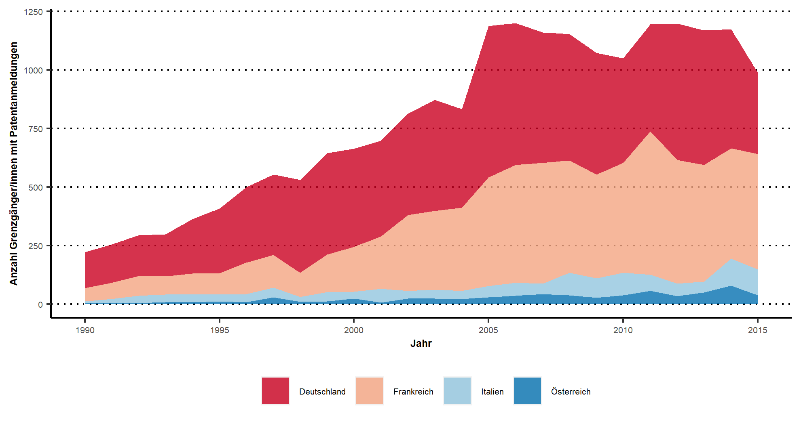
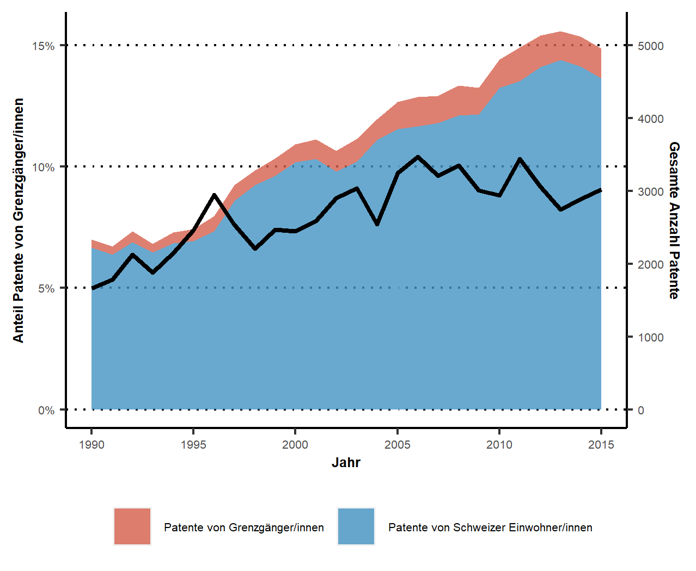

<link href="https://stackpath.bootstrapcdn.com/bootstrap/3.3.5/css/bootstrap.min.css" type="text/css" rel="stylesheet">
<link rel="stylesheet" href="style.css" type="text/css" />

## **Grenzgänger und Innovationen “Made in Switzerland”**

 

*September 2020* verfasst von <a href="https://wwz.unibas.ch/de/personen/matthias-niggli/" target = "_blank">Matthias Niggli</a>, <a href="https://wwz.unibas.ch/de/personen/christian-rutzer/" target = "_blank">Christian Rutzer</a> und <a href="https://wwz.unibas.ch/de/personen/dragan-filimonovic/" target = "_blank">Dragan Filimonovic</a>

 

{width=100%}

Foto: <a href="https://www.flickr.com/photos/stormsworld/8456586910/in/photolist-JfMjzY-Jf3uBk-9HwYDV-ZiCo9F-2jagrVH-HMX3CB-szWiqL-PsKy3L-bRHW5-HbJ87t-mWUYYB-J6PXd-228e7G7-nX4vQD-GAoNUV-AnHZzL-QonY9T-TUXSe1-MynNKE-yoSd93-dwmhsa-WyYCTY-7oFhzy-easv3-4VR2iw-BG4XB8-UkSxzU-ZbG9qo-uYNiyQ-aq6HJV-2gTznUx-3dSjtL-P2g2FQ-8xkuwR-6nJEim-5bA2Ve-5bA2yK-7Xo2QH-8qknKq-5aLf3M-t8HmX-8upbZT-3avCQY-dThdEA-2gaaCH-C2ckEz-5aQ6UU-26Frxpu-bV9qz-57bbjv" target = "_blank">Barry Davis | Flickr</a>

 

**Über 300.000 Personen aus den Nachbarländern pendeln regelmässig über die Grenze, um in der Schweiz zu arbeiten. Viele von ihnen tragen massgeblich zur Entwicklung neuer Innovationen der Schweizer Unternehmen bei. Allerdings werden Erfindungen von Grenzgängern bei den üblichen Innovationsindikatoren oftmals nicht angemessen berücksichtigt. Deshalb könnte die Schweizer Wirtschaft noch innovativer sein als allgemein angenommen. Es sieht danach aus, dass die Innovationstätigkeit der Schweiz als Ganzes um rund 10% unterschätzt wird – und in einigen spezifischen Regionen und Branchen könnte die Innovationskraft sogar um bis zu 30% höher sein als gedacht.**

Pendler aus dem Ausland, sogenannte Grenzgänger, sind wichtig für die Schweizer Wirtschaft. Für einige Regionen der Schweiz und die dort jeweils schwerpunktmässig angesiedelten Industriebranchen gilt dies in ganz besonderem Masse. So zeigen die jüngsten Zahlen des <a href = https://www.bfs.admin.ch/bfs/de/home/statistiken/arbeit-erwerb/erwerbstaetigkeit-arbeitszeit/erwerbstaetige/schweizer-innen-auslaender-innen/grenzgaenger-innen.html target = “_blank”> Bundesamtes für Statistik</a>, dass die Genferseeregion zusammen mit der Region Nordwestschweiz fast 200.000 Grenzgänger anzieht.

Doch wie wirkt sich die hohe Anzahl an Grenzgängern in die Schweiz auf die einheimischen Arbeitskräfte aus? Bezieht man Ergebnisse verschiedener Studien mit ein, so scheint es unwahrscheinlich, dass die Grenzgänger negative Auswirkungen auf die einheimischen Arbeitnehmer haben. In einer aktuellen Forschungsarbeit untersuchen <a href = https://www.research-collection.ethz.ch/bitstream/handle/20.500.11850/432769/wp_486.pdf?sequence=1&isAllowed=y target = “_blank”>Beerli, Ruffner, Siegenthaler & Peri (2020)</a> die Folgen des Personenfreizügigkeitsabkommens zwischen der Schweiz und der EU. Es zeigt sich, dass die damit einhergehende Liberalisierung die Innovationstätigkeit von Schweizer Unternehmen in Grenzregionen gefördert hat. Diese Zunahme an Innovationen hat den grenznahen Schweizer Arbeitsmarkt derart stimuliert, dass sich auch die Nachfrage nach einheimischen Mitarbeitern erhöht hat. Somit hat die Zunahme an Grenzgängern weder bei höher- noch niedriger qualifizierten Beschäftigten zu einer Abnahme der Beschäftigung von Einheimischen geführt. Auch ging das Personenfreizügigkeitsabkommen nicht mit einer Verringerung des Schweizer Lohnniveaus einher – im Gegenteil, die Löhne von hochqualifizierten Arbeitskräften haben sich dadurch sogar erhöht. Diese Ergebnisse stimmen mit anderen Studien überein, die ebenfalls darauf hinweisen, dass die Schweiz von Grenzgängern und der Einwanderung als solche insgesamt profitiert (siehe dazu z.B. <a href = https://cdn.avenir-suisse.ch/production/uploads/2020/09/personenfreizuegigkeit_analyse.pdf target = “_blank”>Avenir Suisse, 2020,</a> für einen Überblick oder <a href = https://www.avenir-suisse.ch/grenzgaenger-teil-der-loesung-nicht-des-problems/ target = “_blank”>Salvi, 2014,</a> für eine kurze Fallstudie).

Die Frage, inwieweit Grenzgänger einen Beitrag zur Innovationslandschaft Schweiz leisten, bleibt jedoch oft unbeantwortet. Darauf wollen wir in diesem Artikel eingehen. Wir werden zeigen, dass Grenzgängerinnen und Grenzgänger wesentlich zur Innovationstätigkeit von Schweizer Unternehmen beitragen. Bemerkenswert ist dabei, dass die Erfindungen von Grenzgängern bei der Messung der Innovationskraft eines Landes typischerweise unberücksichtigt bleiben. Somit scheint der Innovationsoutput der Schweiz deutlich unterschätzt zu werden.

 

### **Welchem Land wird eine Innovation zugeordnet**

Jedes Jahr bewerten Berichte wie der <a href = https://www.globalinnovationindex.org/Home target = “_blank”>Global Innovation Index</a>, der <a href = https://www.weforum.org/reports/how-to-end-a-decade-of-lost-productivity-growth target = “_blank”>Global Competitiveness Report</a> oder der <a href = https://www.wipo.int/publications/en/series/index.jsp?id=38 target= “_blank”>World Intellectual Property Report</a> die Innovationsaktivität von Ländern. Diese Berichte finden sowohl in der Politik als auch in den Medien stets Beachtung (siehe z.B. <a href = https://www.nzz.ch/wirtschaft/wettbewerbsfaehigkeit-schweiz-verliert-deutschland-noch-mehr-ld.1514074?reduced=true target = “_blank”>NZZ, 9.10.2019</a>; <a href =https://www.srf.ch/news/wirtschaft/ranking-wettbewerbsfaehigkeit-die-schweiz-verliert-spitzenplatz target = “_blank”>SRF, 17.10.2018</a>). In diesen Studien werden in der Regel Patente als eine Messgrösse für Innovationskraft verwendet. Es wird ermittelt, wie viele Patente ein bestimmtes Land angemeldet hat. Dabei wird ein Patent immer demjenigen Land zugeordnet, in dem der Erfinder des Patents seinen Wohnsitz hat. Diese Zuordnung ist möglich, da die offiziellen Patentdaten immer auch den Wohnsitz der Erfinder beinhalten, wie das folgende Beispiel zeigt:

 

<a href="https://patentimages.storage.googleapis.com/2d/2c/18/51725e50ce657b/US10029262.pdf" target = "_blank">
{ width=80% }</a>

 

Dieses Patent wurde von neun verschiedenen Erfindern angemeldet. Fünf von ihnen kommen aus Deutschland, vier sind aus der Schweiz. Die Wohnsitze der Deutschen (vor Allem im Raum Karlsruhe) und die Wohnorte der Schweizer (in der Gegend um Bern) sind recht weit voneinander entfernt gelegen. Dies deutet darauf hin, dass zwei verschiedene Arbeitsgruppen für die Patententwicklung zusammengearbeitet haben, die nicht am selben Ort ihren Arbeitsplatz haben, sondern zum Teil in Deutschland und zum Teil in der Schweiz. In einem solchen Fall gibt es verschiedene Möglichkeiten, welchem Land bzw. welchen Ländern das Patent zugeordnet wird. Man könnte es beispielsweise jeweils beiden Ländern gleichermassen zuordnen. Eine andere Möglichkeit wäre die proportionale Aufteilung des Patents auf die Länder entsprechend dem Anteil der Erfinder aus jedem Land. Bei der ersten Option würde unser Beispielpatent zu gleichen Teilen auf Deutschland und die Schweiz aufgeteilt. Bei der letzteren Option würden 5/9 des Patents auf Deutschland und 4/9 auf die Schweiz entfallen. Dieser zweite Ansatz berücksichtigt den im Vergleich zur Schweiz grösseren Anteil von Deutschen bei der Entwicklung des Patents.

<blockquote>***Eine grosse Anzahl an Patenten wird derzeit der Schweiz nicht zugeordnet, obwohl die gesamte Forschung und Entwicklung in einem Schweizer Unternehmen (mit Schweizer Forschungsstätte) durchgeführt wurde.***</blockquote>

Eine dritte Option wäre, das Patent demjenigen Land zuzuordnen, in dem die Firma, die das Patent anmeldet, ihren Sitz hat. In unserem Beispiel ist der Patentinhaber die selFrag AG aus Kerzers (Schweiz). Somit würde bei dieser Vorgehensweise das Patent ausschliesslich der Schweiz zugerechnet werden. Diese Vorgehensweise hat sich in der Literatur nicht durchgesetzt, sondern man betrachtet eher die Wohnsitze der Erfinder, auch weil Patente manchmal von ausländischen Tochtergesellschaften oder ausländischen Firmenzentralen angemeldet werden. Weitere Informationen darüber, wie die Herkunft von Patenten bestimmt werden kann, finden Sie z.B. in <a href = https://www.sbfi.admin.ch/sbfi/en/home/services/publications/data-base-publications/intellectual-property.html target = “_blank”>Bechthold & de Rassenfosse (2019)</a> oder in einem Bericht von <a href = https://www.bertelsmann-stiftung.de/fileadmin/files/user_upload/BST_Weltklassepatente_2020_DT.pdf target = “_blank”>Bertelsmann (S. 68)</a>, der kurz und verständlich das Pro und Contra der verschiedenen Optionen diskutiert.

Die optimale Vorgehensweise bei der Patentzuordnung hängt hauptsächlich von der Fragestellung ab. In diesem Artikel möchten wir untersuchen, wie gross der Innovationsoutput der Schweiz ist. Dabei nutzen wir den gängigsten Ansatz der Patentzuordnung, d.h. wir betrachten die privaten Adressen der Erfinder und nehmen dann eine anteilige Zuordnung zu den jeweiligen Ländern der Wohnsitze vor (vgl. Option zwei). Denken wir nun nochmal an die sehr hohe Zahl an Grenzgängern, die in die Schweiz, z.B. nach Genf oder Basel, pendeln. Wie wird ein Patent abgebildet, wenn alle Autoren eines in der Schweiz entwickelten Patents in den Nachbarländern wohnen und zu ihrem Arbeitsplatz in die Schweiz pendeln? In diesem Fall würde bei unserer Vorgehensweise die Patentzuordnung keinen Bezug zur Schweiz herstellen. D.h. diese Patente, bei denen die gesamte Forschung und Entwicklung in der Schweiz durchgeführt wurde, würde für den Schweizer Innovationsoutput nicht zählen, da der jeweilige Wohnsitz der Erfinder nicht in der Schweiz liegt. Würde evtl. Option drei das Problem lösen, d.h. wenn der Unternehmenssitz, bei dem die Patententwickler arbeiten, ausschlaggebend für die Zuordnung wäre? Leider nein, denn Patente werden wie bereits erwähnt auch oft von ausländischen Tochtergesellschaften angemeldet, obwohl das Unternehmen in der Schweiz ansässig ist. Die folgende Abbildung zeigt ein Patent mit genau diesen Merkmalen.

 

<a href="https://patentimages.storage.googleapis.com/d3/fc/90/f9374c9864e9b2/US7786128.pdf" target = "_blank">
{ width=80% }</a> 

 

Alle Entwickler dieses Patents leben in Deutschland oder Frankreich und als Patentinhaber ist eine U.S.-Niederlassung des Schweizer Pharma-Riesen Hoffmann-La Roche angegeben. Mit den oben beschriebenen Ansätzen würde ein solches Patent folglich der Schweiz nicht zugeordnet werden. Bei genauerer Betrachtung stellt man fest, dass die Wohnorte der Entwickler aber alle sehr nah an der Region Basel liegen (z.B. Grenzach-Wylen, Freiburg), wo sich der Hauptsitz von Hoffmann-La Roche sowie einige seiner wichtigsten Forschungseinrichtungen befinden. Auf deutscher Seite (z.B. in Freiburg oder Grenzach-Wylen) betreibt Hoffmann-La Roche jedoch keine Forschungseinrichtungen, dies geht zumindest aus öffentlich zugänglichen <a href = https://www.roche.com/de/careers/country/germany/de_service/de_locations.html target = “_blank”>Informationen des Unternehmens</a> hervor. Daher ist es sehr wahrscheinlich, dass dieses Patent tatsächlich von Grenzgängern aus Deutschland und Frankreich in Basel entwickelt und im Anschluss von einer U.S.-Niederlassung von Hoffmann-La Roche beim <a href = “https://www.uspto.gov/” target = “_blank”> Patentamt der Vereinigten Staaten (USPTO)</a> angemeldet wurde. Die eigentliche Innovationsarbeit hierfür fand aber in der Schweiz statt, weshalb das Patent ebenfalls der Schweiz zugerechnet werden müsste. Um dieses Problem zu lösen, haben wir einen Ansatz entwickelt, um Grenzgänger in den Patentdaten identifizieren zu können. In der nachfolgenden Box beschreiben wir das Vorgehen. 
 

	

**Erfassung von Schweizer Grenzgängern in den Patentdaten**

  
*Zur Erläuterung unseres methodischen Vorgehens, klicken Sie hier*

Die Patentdaten, die wir für den ersten Schritt der Analyse verwenden, stammen vom U.S.-Patentamt <a href = https://www.uspto.gov/ target = “_blank”>USPTO</a>. Sie decken den Zeitraum von 1990 bis 2015 ab und sind um Mehrfachanmeldungen korrigiert (für weitere Informationen über Mehrfachanmeldungen siehe z.B. <a href = https://www.oecd-ilibrary.org/science-and-technology/analysing-european-and-international-patent-citations_883002633010 target = “_blank”>Webb, Dernis, Harhoff und Hoisl, 2005</a>). Dieser Datensatz enthält sowohl Informationen über den Wohnsitz der Patententwickler als auch über den Sitz der Unternehmen. Er enthält ebenfalls die geographischen Koordinaten der Adressen, sodass Distanzen messbar werden. Jedes Patent ordnen wir genau dem Jahr zu, in dem die Erfindung das erste Mal in irgendeinem Land angemeldet wurde. Da das Datum der Erstanmeldung dem tatsächlichen Zeitpunkt der Erfindung am nächsten kommt, wird es bei der Analyse der Innovationskraft mittels Patentdaten häufig herangezogen (weitere Informationen dazu finden Sie z.B. unter <a href = http://www.oecd.org/science/inno/37569377.pdf target = “_blank”>OECD, 2008</a>). Zwischen der Erstanmeldung eines Patents und dessen Veröffentlichung verstreicht in der Regel einige Zeit. Daher beschränken wir uns bei unserer Analyse auf Patente, deren Erstanmeldung spätestens im Jahre 2015 liegt, da wir davon ausgehen, dass der Grossteil dieser Patente bis heute auch veröffentlicht wurde, was bei später angemeldeten Patenten (z.B. aus dem Jahr 2018) teilweise noch nicht der Fall sein dürfte und dies somit zu Verzerrungen bei der Analyse führen könnte. Aus den beschriebenen Datensätzen entwickeln wir einen empirischen Ansatz, um Innovationen von Grenzgängern, die in der Schweiz arbeiten, zu identifizieren und zu quantifizieren.

Ein Patent ist immer dann möglicherweise die Erfindung eines Grenzgängers, wenn der Erfinder nicht in der Schweiz wohnt, die Firma, die das Patent anmeldet, jedoch in der Schweiz ansässig ist. Wenn mehrere Firmen aus verschiedenen Ländern an der Patententwicklung beteiligt waren, müssen wir jeden Erfinder je eine Firma zuordnen. Dazu weisen wir jedem Erfinder immer diejenige Firma zu, die am nächsten zu seinem Wohnort angesiedelt ist. Die dadurch identifizierten Erfinder sind nun allerdings keineswegs allesamt Schweizer Grenzgänger. Bei dem oben gezeigten Beispielpatent hatte die Firma ihren Sitz in der Schweiz und mehrere der Erfinder lebten in Deutschland. Einer von ihnen lebte z.B. in Hamburg, einer Statdt, die in Norddeutschland liegt. Und von dort aus ist es fast unmöglich in die Schweiz zur Arbeit zu pendeln.
Um Grenzgänger zuverlässig zu identifizieren müssen wir unseren Analyseansatz also verfeinern. Wir führen dazu eine maximale Entfernung zwischen dem Unternehmensstandort und dem Wohnort des Erfinders ein. Als Schwellenwert legen wir fest, dass die Distanz nicht grösser als etwa 100 Kilometer sein darf – bei einer grösseren Entfernung gehen wir davon aus, dass das Pendeln unmöglich ist. Zur Berechnung der Entfernung verwenden wir die Breiten- und Längengrade der jeweiligen Adressen.
Wir weisen einem Erfinder folglich immer genau dann den Status eines Grenzgängers zu, wenn

1. der Erfinder nicht in der Schweiz wohnt **und** 
2. die Firma, die das Patent besitzt, in der Schweiz ansässig ist **und** 
3. der Erfinder nicht zu weit vom Standort des Schweizer Unternehmens entfernt wohnt.
Mit dieser Vorgehensweise würde ein Erfinder, der in Hamburg lebt und ein Patent für eine in Basel ansässige Firma anmeldet, nicht als Grenzgänger angesehen werden, ein in Lörrach wohnender Patentanmelder jedoch schon. Somit können wir Patente, die von Grenzgängern (mit-)entwickelt wurden, der Schweizer Innovationstätigkeit zurechnen, anders als es bisher die übliche Praxis ist (wo lediglich der Wohnort des Erfinders ausschlaggebend für die Zuordnung zu einem Land ist).

Dennoch lassen sich durch den oben genannten Algorithmus noch nicht alle Grenzgänger identifizieren. Wenn eine Schweizer Firma ein Patent über eine ausländische Tochtergesellschaft anmeldet, könnte ein Erfinder fälschlicherweise nicht als Grenzgänger erkannt werden (siehe Beispielpatent zwei). Daher haben wir zunächst alle Unternehmen identifiziert, die eine Reihe an Patenten besitzen, die eindeutig der Schweiz zugeordnet werden können, da sowohl die Firma als auch die Erfinder in der Schweiz ansässig sind. Aus dieser Liste von Unternehmen haben wir abgeleitet, welche Firmen eine Forschungseinrichtung in der Schweiz haben. So konnten wir ausländische Tochtergesellschaften mit den Schweizer Forschungsstätten verknüpfen und die geographischen Koordinaten der Forschungsstätten (anstatt des ausländischen Unternehmenssitzes) für die weitere Analyse heranziehen.
Somit weisen wir einem Erfinder auch dann den Status eines Grenzgängers zu, wenn

1. der Erfinder nicht in der Schweiz wohnt **und** 
2. die Tochtergesellschaft des Unternehmens, die das Patent anmeldet, nicht in der Schweiz oder in dem Land ansässig ist, aus dem der Erfinder stammt **und**
3. das Unternehmen, das das Patent besitzt, einen Forschungsstandort in der Schweiz hat **und**
4. der Erfinder nicht allzu weit vom Forschungsstandort des Unternehmens in der Schweiz entfernt wohnt.
Bisherh haben wir in unserer Analyse Patente des <a href = “https://www.epo.org/index_de.html” target = “_blank”>Europäischen Patentamts (EPA)</a> nicht berücksichtigt, was ein grosses Manko sein könnte. Die Patentdaten des EPA werden durch die <a href="http://www.oecd.org/sti/inno/intellectual-property-statistics-and-analysis.htm" target ="blank">OECD</a> zur Verfügung gestellt. Unser zuvor dargelegter Algorithmus lässt sich auf diese Patente nicht exakt anwenden, da die EPA-Patentdaten keine Informationen über geographische Koordinaten beinhalten. Wir benötigen daher einen weiteren Ansatz, um auch die Erfinder von EPA-Patenten ggf. als Grenzgänger identifizieren zu können. Dabei gehen wir wie folgt vor: Zunächst sei angemerkt, dass wir nur diejenigen EPA-Patente von Schweizer Unternehmen analysieren, für die kein äquivalentes USPTO-Patent vorliegt, da es sich ansonsten um eine Mehrfachanmeldung handeln würde und diese durch die oben beschriebene Analyse der USPTO-Patente bereits untersucht worden wäre. Wie zuvor prüfen wir anschliessend bei jedem EPA-Patent, ob der Firmenstandort in der Schweiz liegt und gleichzeitig der Erfinder in einem anderen Land lebt. Ist dies der Fall, dann überprüfen wir wiederum die Distanz zwischen dem Wohnort und dem Unternehmenssitz. Anstelle von geographischen Koordinaten betrachten wir bei den EPA-Patenten nun die *Regionen*, in denen der Wohnort bzw. der Unternehmenssitz liegt. Dabei gehen wir davon aus, dass das Pendeln zu einem Schweizer Arbeitsplatz nur für Erfinder möglich ist, die in einer ausländischen Region wohnen, die sehr nahe an der Schweizer Grenze liegt. Folgende Regionen definieren wir als *sehr nahe an der Schweizer Grenze liegend*: "Freiburg" und "Schwaben" für Grenzgänger aus Deutschland, "Elsass", "Rhône-Alpes", "Lothringen" und "Franche-Comté" für Grenzgänger aus Frankreich, "Lombardei" und "Piemont" für Grenzgänger aus Italien und die Region "Vorarlberg" für solche aus Österreicher. Erfinder, die ausserhalb dieser Regionen leben, schliessen wir als potenzielle Grenzgänger aus. Darüber hinaus machen wir zusätzliche Einschränkungen bezüglich der Unternehmenssitze. Wir legen fest, dass Erfinder aus Deutschland nur in die Schweizer Regionen "Nordwestschweiz", "Zürich" oder "Ostschweiz" pendeln, französische Pendler nur in die "Nordwestschweiz" oder in die "Genferseeregion", Italiener nur ins "Tessin" und Österreicher nur in die "Ostschweiz".

Zusammengefasst weisen wir einem Erfinder eines EPA-Patents nur dann den Status eines Grenzgängers zu, wenn

1. der Erfinder nicht in der Schweiz, sondern in einer grenznahen Region lebt **und** 
2. die Firma, die das Patent besitzt, in der Schweiz ansässig ist **und** 
3. das Unternehmen in einer Schweizer Region ansässig ist, die sich in der Nähe der ausländischen Region befindet, in welcher der Erfinder lebt.

Da diese Definition etwas enger gefasst ist als zuvor bei den USPTO-Patenten, nehmen wir in Kauf, ggf. einzelne Grenzgänger bei den EPA-Patenten zu übersehen. Alle identifizierten Grenzgänger sind aber mit sehr hoher Wahrscheinlichkeit tatsächlich grenzüberschreitende Pendler in die Schweiz – in der Analyse der EPA-Patente werden die Grenzgänger also eher unter- als überschätzt.

Wie viele Patente werden denn nun von Grenzgängern (mit-)entwickelt? Gibt es eine nennenswerte Anzahl an Patenten, die bisher der Schweiz nicht zugerechnet wurden, obwohl diese von Schweizer Unternehmen stammen? Unsere Ergebnisse für das USPTO und das EPA zusammengenommen zeigen, dass im Laufe der Zeit wahrscheinlich 21'799 Patente von Schweizer Grenzgängern (mit-)entwickelt wurden. Im nächsten Abschnitt gehen wir darauf ein, was dies für die Innovationstätigkeit der Schweiz bedeutet. 

 

### **Grenzgänger und Innovationen «Made in Switzerland»** 

Mithilfe der oben beschriebenen Analyse können wir die Anzahl an Erfindungen ermitteln, die von Schweizer Grenzgängern stammen. Dabei verwenden wir für U.S.-amerikanische Patente die Patentdaten des <a href = https://www.uspto.gov/ target = “_blank”>USPTO</a> und für europäische Patente die Patentdaten der <a href=http://www.oecd.org/sti/inno/intellectual-property-statistics-and-analysis.htm target ="blank">OECD</a>. 

Was zeigt nun unsere Analyse? Schauen wir uns zunächst die Anzahl an Erfindern an, die aus den Nachbarländern an einen Schweizer Arbeitsplatz pendeln. Die nachstehende Abbildung zeigt die absolute Zahl der grenzüberschreitend-pendelnden Erfinder, differenziert nach Herkunftsland.

 

 

##### ***Herkunftsländer der Grenzgänger***
{ width=100% }
*Quelle: Eigene Berechnungen des CIEB basierend auf Daten des <a href="https://www.uspto.gov/" target ="blank">USPTO</a> und der <a href = "http://www.oecd.org/sti/inno/intellectual-property-statistics-and-analysis.htm" target ="blank">OECD</a>. Die Daten für diese Grafik finden Sie auf <a href= "https://github.com/cieb-unibas/innovation-origins" target="_blank">GitHub</a>.*

 

Zu Beginn der 1990er Jahre gab es relativ wenige Erfinder, die über die Grenze in die Schweiz pendelten - die meisten von ihnen kamen aus Deutschland. Bis 2005 ist ihre Zahl jedoch auf insgesamt über 1000 Personen angestiegen, wobei diese Pendler aus allen vier Nachbarländern kommen. Dies deckt sich mit den Erkenntnissen von <a href = https://www.research-collection.ethz.ch/bitstream/handle/20.500.11850/432769/wp_486.pdf?sequence=1&isAllowed=y target = “_blank”>Beerli, Ruffner, Siegenthaler & Peri (2020)</a>. Gemäss diesen Autoren nahm der Strom an Grenzgängern in die Schweiz nach dem in Kraft treten der Personenfreizügigkeit zu Beginn des 21. Jahrhunderts stark zu. Dabei weisen die Autoren darauf hin, dass dieser zusätzliche Pendlerstrom in die Schweiz vor allem für Forschungs- und Entwicklungstätigkeit relevant gewesen sei – sie stützen sich dabei auf Umfrageergebnisse. In unserer Analyse untersuchen wir zwar keine kausalen Zusammenhänge zwischen der erwähnten Liberalisierung und der Forschungsaktivität der Schweiz. Dennoch scheint unsere Untersuchung zur Bedeutung von Grenzgängern bei Patentanmeldungen von Schweizer Firmen diese Ergebnisse zu stützen. 

Ein sehr wichtiges Ergebnis unserer Arbeit ist ausserdem, dass die Schweizer Innovationsleistung in den üblichen Berechnungen bisher vermutlich erheblich unterschätzt wurde, da Patente von grenzüberschreitenden Pendlern dort nicht der Schweiz zugerechnet werden. Das Ausmass dieser Verzerrung ist in der nächsten Abbildung zu sehen. Betrachten wir zunächst die bunt gefärbten Bereiche. Sie zeigen die absolute Zahl der Patente, die von in der Schweiz wohnhaften Personen (blau) bzw. von Grenzgängern (rot) erfunden wurden. Die Zahl der Patente hat im Laufe der Zeit sowohl bei den in der Schweiz ansässigen Personen als auch bei den Grenzgängern zugenommen (für einen allgemeinen Überblick über die Patentanmeldungen in der Schweiz siehe  <a href=https://www.research-collection.ethz.ch/bitstream/handle/20.500.11850/119256/eth-49547-01.pdf?sequence=1&isAllowed=y target = “_blank”> Arvanitis et al., 2015</a>). Wie man sieht ist der Patent-Output der Schweiz deutlich höher, wenn man auch die Grenzgänger berücksichtigt. Die schwarze durchgezogene Linie gibt den Anteil der Patente an, die von Grenzgängern erfunden wurden (d.h. den Anteil des roten Bereichs). Diese Linie zeigt eindrücklich, wie wichtig die Grenzgänger für die Innovationskraft zu sein scheinen. Bereits 1990 waren rund 5% aller in der Schweiz entwickelten Patente Erfindungen von Grenzgängern. Dieser Anteil verdoppelte sich auf rund 10% im Jahr 2005 und ist seither auf diesem Niveau relativ stabil geblieben.

 

##### ***Patentanmeldungen von Schweizer Grenzgängern***
{ width=100% }
*Quelle: Eigene Berechnungen des CIEB basierend auf Daten des <a href="https://www.uspto.gov/" target ="blank">USPTO</a> und der <a href = "http://www.oecd.org/sti/inno/intellectual-property-statistics-and-analysis.htm" target ="blank">OECD</a>. Die Daten für diese Grafik finden Sie auf <a href= "https://github.com/cieb-unibas/innovation-origins" target="_blank">GitHub</a>.*

 

Was lässt sich aus diesen Ergebnissen ableiten? Zunächst stellen wir fest, dass die Schweizer Innovationstätigkeit um rund 10% unterschätzt werden könnte, falls Grenzgänger nicht berücksichtigt werden. Ausserdem erscheint es aufgrund der Ergebnisse unwahrscheinlich, dass Grenzgänger inländische Erfinder ersetzt haben, da der Anteil der Patente von Grenzgängern in den letzten 10 Jahren nicht weiter zugenommen hat.

<blockquote>***Die Schweizer Innovationstätigkeit könnte um rund 10% unterschätzt werden, falls Grenzgänger nicht berücksichtigt werden.***</blockquote>

Stattdessen hat die Patent-Aktivität sowohl von in der Schweiz ansässigen Personen als auch von Grenzgängern rapide zugenommen, was darauf hindeutet, dass die Schweizer Wirtschaft erheblich von den Erfindern profitiert, die grenzüberschreitend pendeln. Dies steht wiederum im Einklang mit den Ergebnissen von <a href = https://www.research-collection.ethz.ch/bitstream/handle/20.500.11850/432769/wp_486.pdf?sequence=1&isAllowed=y target = “_blank”>Beerli, Ruffner, Siegenthaler & Peri (2020)</a>. Mehr Erfinder, die grenzüberschreitend pendeln, gehen Hand in Hand mit mehr Patenten, die sowohl von in der Schweiz ansässigen Personen als auch von Pendlern angemeldet werden. Dies stützt erneut das Argument, dass die Schweizer Innovationskraft durch den zusätzlichen Pendlerstrom stark profitieren konnte.

 

Grenzgänger scheinen den Innovationsmotor der Schweizer Wirtschaft deutlich anzutreiben, für einzelne Regionen und Branchen könnte dies jedoch in besonderem Masse zutreffen. In der untenstehenden Grafik können Sie dies selbstständig weiter untersuchen. Wählen Sie dazu je nach Interesse eine Schweizer Region (gemäss <a href = http://www.oecd.org/cfe/regionaldevelopment/territorial-grid.pdf target = “_blank”>OECD</a>-Definition) oder ein Technologiefeld (gemäss <a href = https://www.wipo.int/export/sites/www/ipstats/en/statistics/patents/pdf/wipo_ipc_technology.pdf target = “_blank”>WIPO</a>-Definition) aus - die Grafik wird Ihnen die Patentzahlen und den Anteil der Grenzgänger-Patente für die von Ihnen gewählte Region oder das von Ihnen gewählte Technologiefeld anzeigen.

<blockquote>***Grenzgänger scheinen den Innovationsmotor der Schweizer Wirtschaft deutlich anzutreiben.***</blockquote> 

Beachten Sie bitte bei der Grafik, dass im Gegensatz zur vorherigen Darstellung die Zahlen und Anteile nicht jährlich, sondern über 3-Jahres-Perioden bis zum Jahr 2011 berechnet werden. Wir wählen diesen grösseren Zeitraum, da die Anzahl der Patente in einem einzigen Jahr für einige Industriezweige recht niedrig sein kann und die Anteile der Grenzgänger daher bei jährlicher Auszählung stark schwanken würden. Die Verwendung von 3-Jahres-Perioden gleicht solche Schwankungen aus. Ferner sei erwähnt, dass das Pendeln aus dem Ausland vor der Personenfreizügigkeit zu Beginn des 21. Jahrhunderts auf grenznahe Regionen beschränkt war. Dennoch gibt es einige Grenzgängerinnen und Grenzgänger, deren Wohnorte in Nicht-Grenzgebieten der Zentralschweiz (Kantone Luzern, Uri, Schwyz, Zug, Nidwalden und Obwalden) lagen. Die wahrscheinlichsten Gründe dafür sind, dass diese Erfinder entweder keine Grenzgänger im juristischen Sinne waren (z.B. weil sie zwar eine ausländische Adresse hatten, die sie auf der Patentdokumentation angaben, aber eigentlich in der Schweiz wohnten) oder das Patent zwar von einem Firmensitz in der Zentralschweiz angemeldet wurde, obwohl die eigentliche Forschung in einem Labor in der Grenzregion durchgeführt wurde.

 

##### ***Schweizer Grenzgänger nach Regionen und Branchen***
<iframe width="100%" height=560 frameBorder="0" src='https://cieb.shinyapps.io/cross_border_plot_de/'>
  
Your browser does not support iframes

</iframe>
*Quelle: Eigene Berechnungen des CIEB basierend auf Daten des <a href="https://www.uspto.gov/" target ="blank">USPTO</a> und der <a href = "http://www.oecd.org/sti/inno/intellectual-property-statistics-and-analysis.htm" target ="blank">OECD</a>. Die Daten für diese Grafik finden Sie auf <a href= "https://github.com/cieb-unibas/innovation-origins" target="_blank">GitHub</a>.*

 

Der Anteil der Grenzgänger-Patente variiert von nur etwa 0,5-1% im Schweizer Mittelland bis zu einem Maximum von fast 30% in den Grenzregionen Nordwestschweiz und Tessin. Dieselbe Streuung zeigt sich für verschiedene Technologiebereiche: "16 Pharmazeutische Erzeugnisse", der wichtigste Exportsektor der Schweizer Wirtschaft, hat den bei weitem höchsten Anteil an Grenzgänger-Patenten (bis über 30%). Auch in vielen anderen Bereichen der Chemie und Biologie sind die Grenzgänger-Anteile relativ hoch. Dies liegt vermutlich daran, dass die grenznahe Stadt Basel für die Schweizer Pharma- und Chemiebranche der wichtigste Standort darstellt.

Eine weitere interessante Beobachtung ist folgende: im Laufe der Zeit steigt die Zahl von Grenzgänger-Patenten in boomenden Bereichen wie "4 Digitale Kommunikation", "6 Computertechnik", "24 Umwelttechnik" oder "13 Medizintechnik" an. In besonders dynamischen und aufstrebenden Technologiefeldern scheint es folglich besonders wichtig zu sein, Grenzgänger einstellen zu können. 

<blockquote>***Offene Grenzen sind ein Schlüssel für hochwertige Schweizer Innovationen.***</blockquote>

Alle diese Ergebnisse deuten darauf hin, dass offene Grenzen ein Schlüssel für hochwertige Schweizer Innovationen sind. Ohne die Möglichkeit, grenzüberschreitend-pendelnde Forscher und Entwickler rekrutieren zu können, könnte der Patent-Output der Schweiz insgesamt deutlich geringer ausfallen. An dieser Stelle seien neben den Grenzgängern auch die vielen hochqualifizierten Einwanderer erwähnt, die in der Schweiz beschäftigt sind. Wenn die Schweizer Wirtschaft nicht mehr vom Wissen all dieser ausländischen Arbeitskräfte profitieren könnte, würde sich ihre Innovationskraft höchstwahrscheinlich deutlich verringern. Dies wäre auch deshalb besorgniserregend, da die Grenzgänger insbesondere in hochdynamischen und zukunftsträchtigen Technologiefeldern wie Informatik, Biotechnologie, Pharmazie und Umwelttechnologie äusserst wichtig zu sein scheinen.   

 

**Falls Sie an einem Vergleich** der Schweizer Pharma mit anderen Ländern interessiert sind, dann könnte für Sie unsere Analyse <a href = https://innoscape.ch/en/publications/the-pharmaceutical-industry-a-driver-of-innovation-and-growth-in-switzerland target = “_blank”> Pharma Schweiz: Ein Treiber für Wachstum und Innovation</a> (in englischer Sprache) interessant sein.

 

**Diesen Artikel teilen**

 
*Dieser Artikel wurde mithilfe von <a href = https://rmarkdown.rstudio.com/ target = “_blank”>R Markdown</a> und <a href = https://shiny.rstudio.com/ target = “_blank”>R shiny</a> geschrieben. Die Berechnungen zur Identifizierung von grenzüberschreitend pendelnden Patent-Entwicklern wurden im wissenschaftlichen Rechenzentrum <a href = http://scicore.unibas.ch/ target = “_blank”> sciCORE </a> der Universität Basel durchgeführt. Die Daten und Algorithmen zur Reproduktion der in diesem Artikel vorgestellten Zahlen sind auf <a href= "https://github.com/cieb-unibas/innovation-origins" target="_blank">GitHub</a> verfügbar.*
 
 
 
 

<!-- Global site tag (gtag.js) - Google Analytics -->

